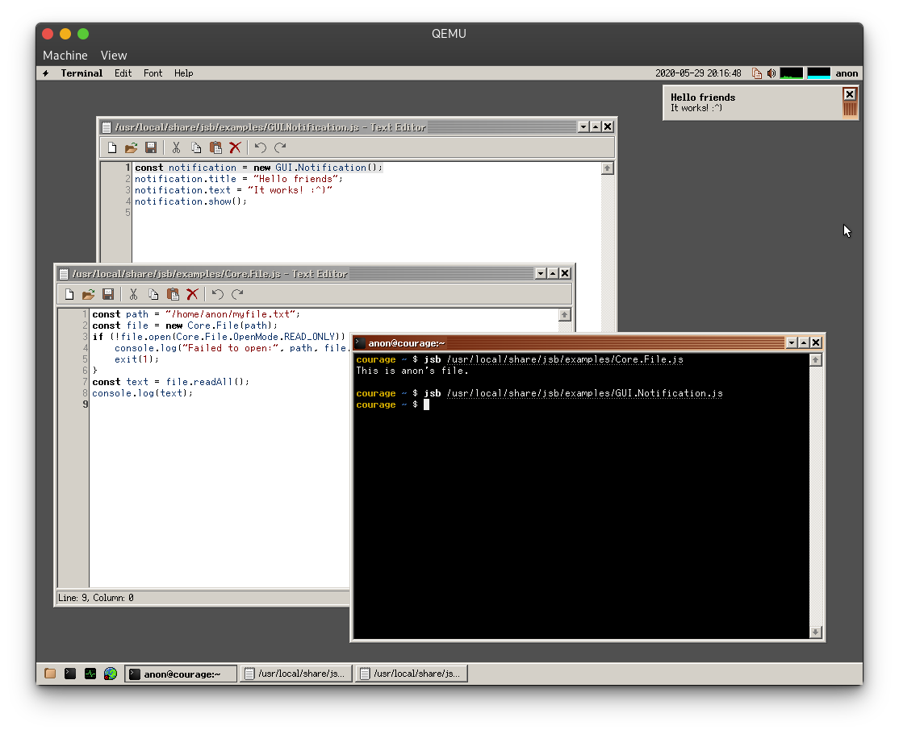

# LibJS Bindings

> LibJS Bindings for some of the SerenityOS C++ libraries

## Installation

Make sure you've already built Serenity and exposed `SERENITY_ROOT`. Then:

- Clone the repository
- Run [`./build.sh`](build.sh)

It will download a fresh copy of [Serenity's `Userland/js.cpp`](https://github.com/SerenityOS/serenity/blob/master/Userland/js.cpp),
patch it to replace the default global object and install it as `jsb` (JavaScript
Bindings) in `$SERENITY_ROOT/Build/Root/usr/local/bin`, along with some examples
in `$SERENITY_ROOT/Build/Root/usr/local/share/jsb/examples`.

Then run `make image && make run`.

## Why

First steps towards [`SerenityOS/serenity issue #1558`](https://github.com/SerenityOS/serenity/issues/1558).

Instead of "just" a clone of some Node.js APIs for LibJS we would want bindings
for the existing SerenityOS-specific libraries like `LibCore`, `LibGfx`, `LibGUI` etc.

## Non-goals

- An exact mapping of C++ APIs to JavaScript - some things just can't be translated
  directly or would be quite unusual for JS. Examples:
  - `Foo::Bar::construct(baz)` becomes `Foo.Bar(baz)`
  - `Foo::Enum::SomeMember` becomes `Foo.Enum.SOME_MEMBER`
  Also `snake_case` becomes `camelCase` as the latter is a lot more common in JS.
- Bindings for *all* libraries - some stuff is just not useful in a JavaScript context.
- Making this a long-term separate project. This is just me playing around and
  trying things - if it works out it'll probably end up in Serenity itself. If
  it doesn't, we'll go a different way and get some bindings in the end anyway.

## License

2-clause BSD, same as Serenity.
